```mermaid
stateDiagram-v2
    direction TB

    state "Bloco de Milhares" as Milhares {
        [*] --> qM0
        qM0 --> qM1 : M
        qM1 --> qM2 : M
        qM2 --> qM3 : M
    }

    state "Bloco de Centenas" as Centenas {
        qH0 --> qC : C
        qC --> qCC : C
        qCC --> qCCC : C
        qC --> qHF : D (CD) / M (CM)
        qH0 --> qD : D
        qD --> qDC : C
        qDC --> qDCC : C
        qDCC --> qDCCC : C
    }

    state "Bloco de Dezenas" as Dezenas {
        qT0 --> qX : X
        qX --> qXX : X
        qXX --> qXXX : X
        qX --> qTF : L (XL) / C (XC)
        qT0 --> qL : L
        qL --> qLX : X
        qLX --> qLXX : X
        qLXX --> qLXXX : X
    }

    state "Bloco de Unidades" as Unidades {
        qU0 --> qI : I
        qI --> qII : I
        qII --> qIII : I
        qI --> qF : V (IV) / X (IX)
        qU0 --> qV : V
        qV --> qVI : I
        qVI --> qVII : I
        qVII --> qVIII : I
    }

    %% Conexões verticais entre blocos
    [*] --> Milhares
    Milhares --> Centenas : C, D
    Centenas --> Dezenas : X, L
    Dezenas --> Unidades : I, V

    %% Aceitação final
    Unidades --> [*]
```

# EP01-LFA

# Tradutor de Números Romanos – Autômato Finito Determinístico (Transdutor)

## Descrição

Este projeto implementa um **Transdutor Finito Determinístico (AFD)** capaz de reconhecer números representados em **algarismos romanos** e convertê-los para o sistema **indo-arábico (decimal)**.

O autômato percorre a cadeia de entrada símbolo por símbolo e, a cada transição válida, acumula o valor decimal correspondente.

O sistema também valida a entrada, rejeitando sequências inválidas como:

- IC
- VX
- MMMM

O tradutor reconhece números romanos até **3999**, seguindo as regras tradicionais da numeração romana.

---

# Modelo Formal do Autômato

O transdutor pode ser definido formalmente como:

```

T = (Q, Σ, Γ, δ, λ, q0, F)

```

Onde:

## Q – Conjunto de Estados

O conjunto de estados representa os possíveis contextos da leitura da cadeia.

Exemplos de estados utilizados:

```

Q = {
q0,
qM1, qM2, qM3,
qH0,
qT0,
qU0,
qI, qII, qIII,
qV, qVI, qVII, qVIII,
qF
}

```

Cada grupo de estados representa uma **parte do número romano**:

- Milhares
- Centenas
- Dezenas
- Unidades

---

## Σ – Alfabeto de Entrada

O alfabeto de entrada é formado pelos símbolos da numeração romana:

```

Σ = { I, V, X, L, C, D, M }

```

---

## Γ – Alfabeto de Saída

O alfabeto de saída corresponde aos valores decimais que podem ser emitidos durante as transições:

```

Γ = { 1, 3, 5, 8, 10, 30, 50, 80, 100, 300, 500, 800, 1000 }

```

Valores como 3, 8, 30, 80, 300 e 800 aparecem pois eles são emitidos durante as transições para corrigir as notações de subtração, como IV, IX, XL, etc.

---

## q0 – Estado Inicial

```

q0

```

Representa o estado inicial antes da leitura da cadeia.

---

## F – Conjunto de Estados Finais

Estados que representam o reconhecimento válido da cadeia.

Exemplo:

```

F = { q0, qI, qII, qIII, qV, qVI, qVII, qVIII, qF }

```

---

# Tipo de Transdutor

O modelo implementado é um **Transdutor de Mealy**.

### Motivo

A saída depende **da transição realizada**, ou seja, do par:

```

(estado atual, símbolo de entrada)

```

Exemplo:

```

δ(qI, V) → qF
λ(qI, V) = +3

```

Isso ocorre no caso da conversão de **IV**, onde:

```

1 + 3 = 4

```

Portanto a saída é produzida **na transição**, característica do modelo de **Mealy**.

---

### Transições sem saída

O autômato também possui transições lógicas que servem apenas para mudar o contexto da leitura sem consumir o símbolo e nem emitir saída.

Nesses casos, a função de saída resulta em um conjunto vazio ($\lambda = \emptyset$).

Exemplo (Lendo "C" após ler um "M"):
```

δ(qM1, C) → qH0
λ(qM1, C) = ∅

```

No nosso projeto, isso é implementado usando o comando `next`, que altera o estado atual para o próximo grupo, mas repassa o mesmo símbolo de entrada para ser reavaliado e ser capaz de gerar uma saída na próxima transição entre estados.

---


# Regras da Numeração Romana

| Símbolo | Valor |
|-------|------|
| I | 1 |
| V | 5 |
| X | 10 |
| L | 50 |
| C | 100 |
| D | 500 |
| M | 1000 |

### Regras aplicadas

Se um símbolo menor vier **antes** de um maior → **subtração**

Exemplo:

```

IV = 4
IX = 9

```

Se um símbolo menor vier **depois** de um maior → **adição**

Exemplo:

```

VI = 6
VIII = 8

```

---

# Exemplos de Conversão

| Romano | Decimal |
|------|------|
| III | 3 |
| IV | 4 |
| IX | 9 |
| XIV | 14 |
| XXIX | 29 |
| XLII | 42 |
| LXXXVIII | 88 |
| CXCIV | 194 |
| MCMXC | 1990 |
| MMXXIV | 2024 |

---

# Estrutura do Projeto

```

EP01-LFA/
│
├── src/
│   └── main.rb
│
├── docs/
│   └── automato.mmd
│
└── README.md

```

---

# Execução

Para executar o programa:

```

ruby main.rb

```

Exemplo de uso:

```

Digite um número romano: VIII
Resultado: 8

```

---

# Complexidade

O autômato percorre a cadeia **uma única vez**.

Portanto a complexidade é:

```

O(n)

```

onde **n** é o tamanho da cadeia de entrada.

---

# Diagrama do Autômato

O diagrama do autômato foi modelado utilizando **Mermaid** e pode ser encontrado em:

```

docs/modelagem.mmd

```
# Diagrama do Autômato

